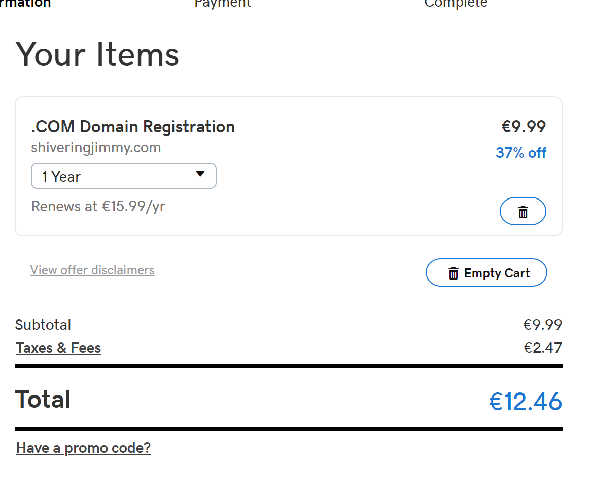
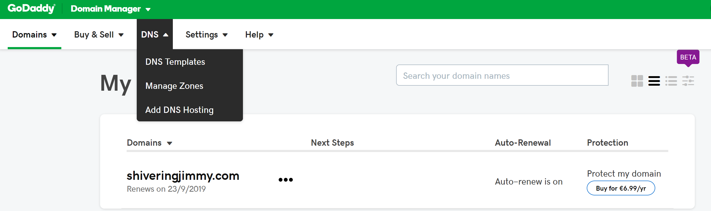
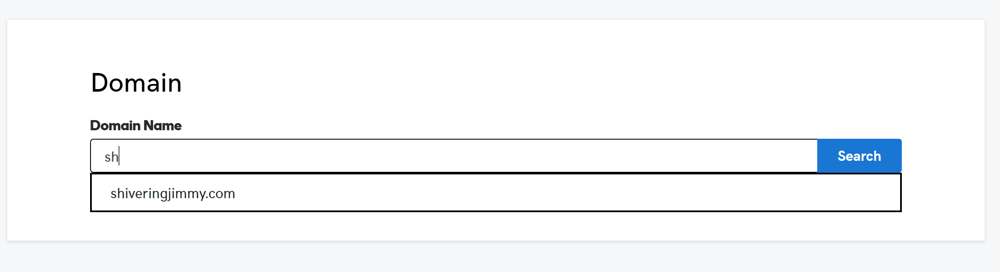
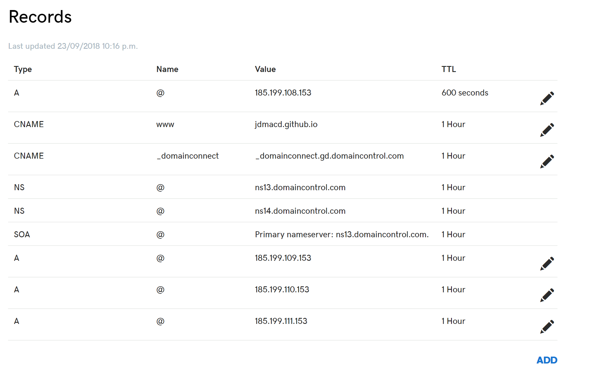
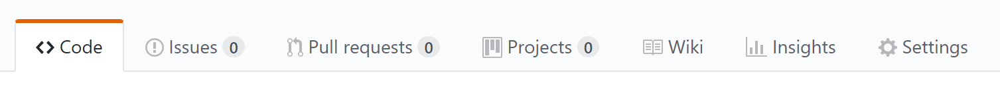
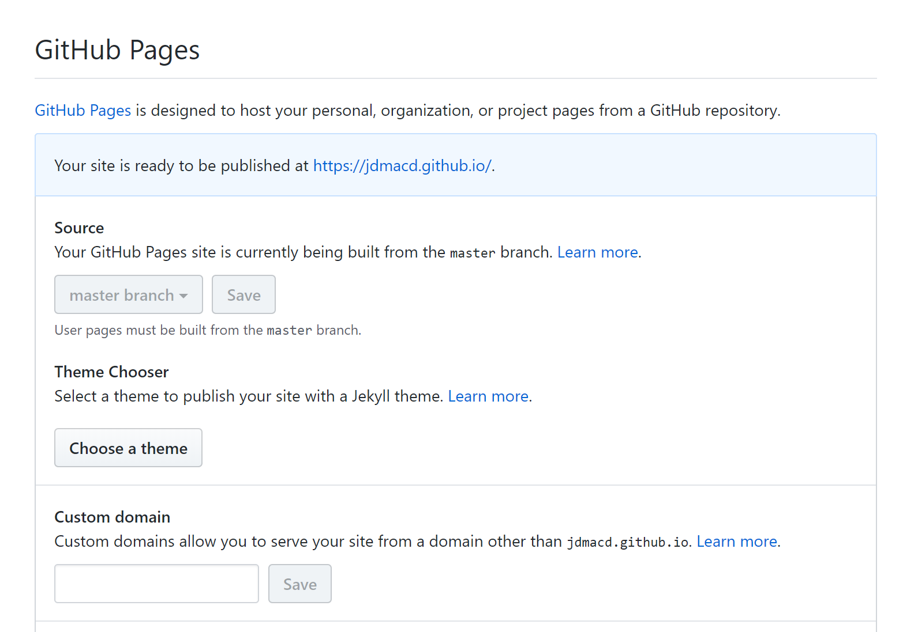

# Buying and configuring a domain

## Create a GoDaddy Account

Go to the [godaddy website](https://ie.godaddy.com/) and create an account.

## Search for and buy a domain name

This is the fun part. A domain can cost between 1 and 50 euro



## Point your new domain at your website host (Github)

Select *Manage Zones* from the *DNS* Menu



Type in your domain name.



Make the following changes to the DNS records



Initially you will have only one `A` record which you will change to `185.199.108.153`

You will then create 3 more `A` records with the following values

```
185.199.108.153
185.199.109.153
185.199.110.153
185.199.111.153
```

Lastly, you will edit the CNAME record to point at your Github URL.

## Back on Github..

Select *Settings*



Scroll down to the `github pages` section and put your newly purchased address under **Custom domain** and select **Enforce https**



It may take a few hours for your new domain name record to propogate across servers, be patient!