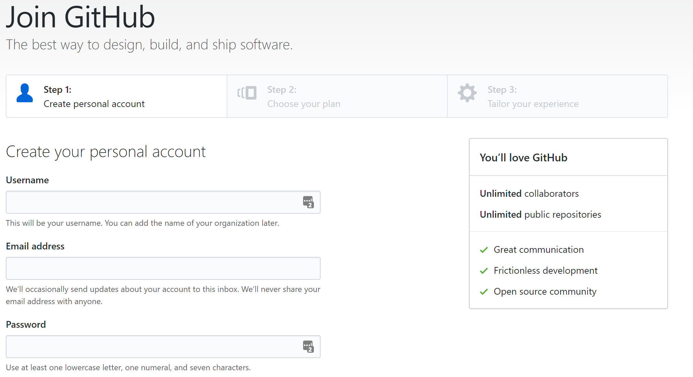
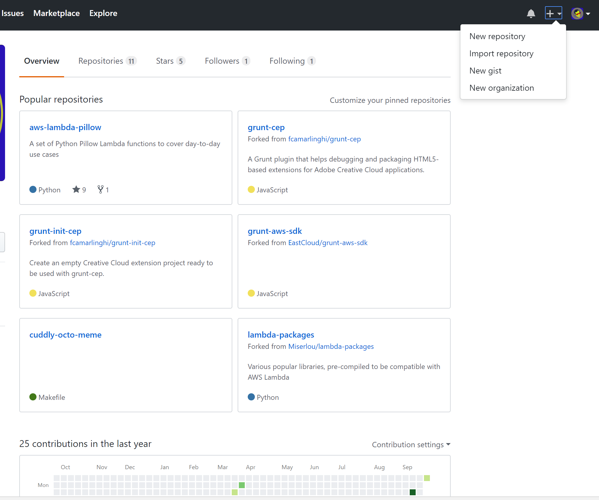
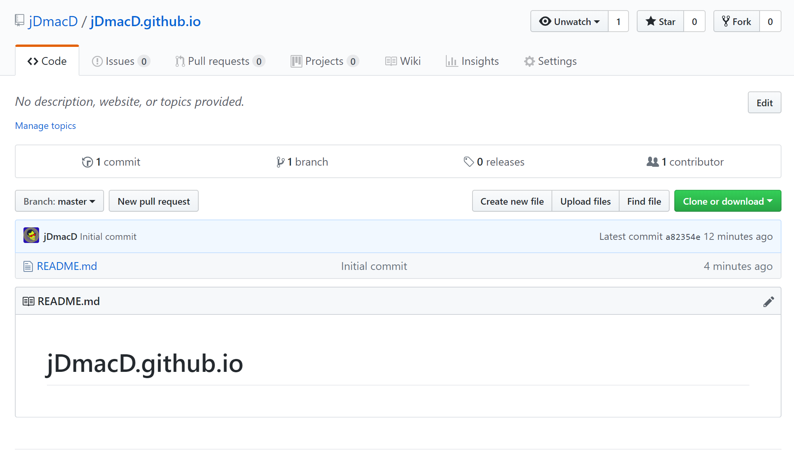
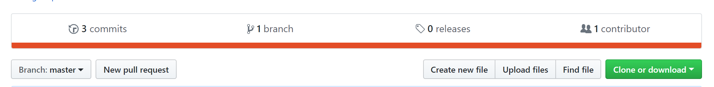
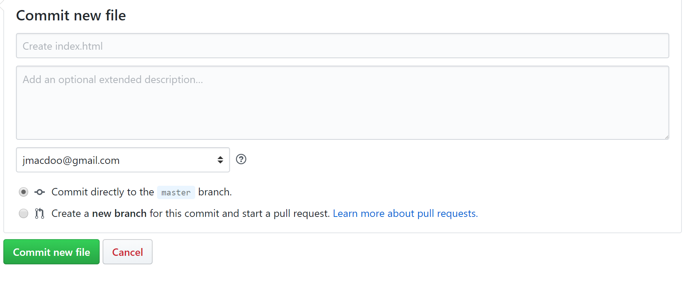
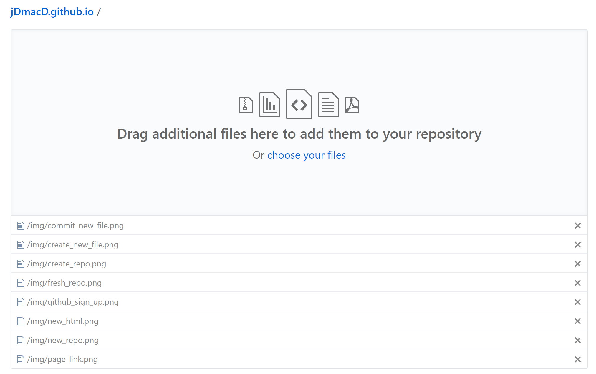

# Free Hosting!

## Open a github account

Go to the Github site and [sign up here](https://github.com/join?source=header-home)



## Create a project

Select **New Repository** from the drop down in the top right hand corner



Create a project named username.github.io, where username is your username on GitHub.

Tick the *Initialise this repository with a README* option.

Select *Create repository*.

Bingo! you're done. You should now have something like this:



## Adding files

We can now add a basic `index.html` file

Select *Create new file*



Name it `index.html` and add a line of html

```
<h1>Hello, world!</h1>
```
Scroll to the bottom off the page and select *Commit new file*



## Visit your new site

Go to https://**your github username**.github.io

My username is **jdmacd**, so my address is [https://jdmacd.github.io](https://jdmacd.github.io)

## Adding multiple files

You can perform a bulk upload by selecting *Upload files*



